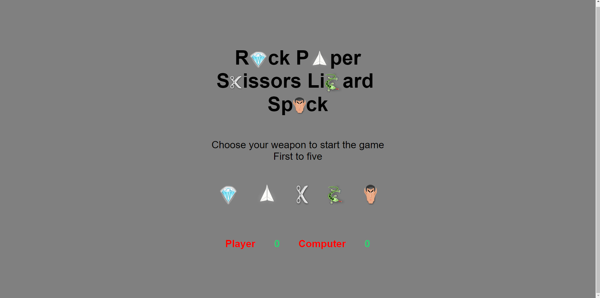
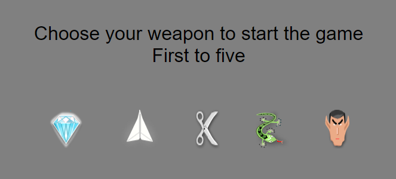
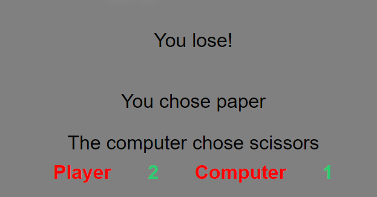

# Rock-Paper-Scissors-Lizard-Spock
This is a simple implementation of the popular game Rock-Paper-Scissors-Lizard-Spock using HTML, CSS, and JavaScript.

How to play
To play the game, simply open the index.html file in a web browser. 
You will see a game board with five buttons representing the game's options: rock, paper, scissors, lizard, and spock. 
Click on one of the buttons to make your choice, and the computer will randomly choose its own option. 
The winner of the round will be determined according to the following rules:

Scissors cut paper
Paper covers rock
Rock crushes lizard
Lizard poisons Spock
Spock smashes scissors
Scissors decapitate lizard
Lizard eats paper
Paper disproves Spock
Spock vaporizes rock
Rock crushes scissors
The game will keep track of the score, and the first player to reach five points will win the game. 
Once the game is over, an alert will show and when you click OK the game will reset.

## Features

- A game of rock-paper-scissors-lizard-spock
- 
- A user interface with buttons for the user to select their move and a display area to show the game result and scores
- 
- The ability for the user to play multiple rounds of the game until one player reaches a score of 5
- A randomly generated computer move for each round
- The game logic that determines the winner of each round based on the rules of rock-paper-scissors-lizard-spock
- 
- The ability to reset the game and start a new round after one player reaches a score of 5

## Testing

- I have sent this page to alot of friends that work in the industri to test it then 
  changed what needed to be changed.

- Html was tested with no error using https://jigsaw.w3.org/css-validator/

- Css was tested with no error using https://jigsaw.w3.org/css-validator/

- Javascript was tested with no error using https://esprima.org/demo/validate.html

## Deployment

- The site was deployed to GitHub pages. 
  The steps to deploy are as follows:
  In the GitHub repository, navigate to the Settings tab
  From the source section drop-down menu, select the Master Branch
  Once the master branch has been selected, the page will be automatically 
  refreshed with  a detailed ribbon display to indicate the successful deployment.
  The live link can be found here - 
  https://smiding.github.io/Proj2/

## Credits

- Kevin Witeker that helped with the testing
- Jessica Rydberg that helped with testing and coding questions.

- Images was taken from https://rpsls.net/#91np2.

 - Font where provided from Goggle fonts.

- Youtube videos that got information from:
  - https://www.youtube.com/watch?v=ec8vSKJuZTk
  - https://www.youtube.com/watch?v=GFO_txvwK_c&list=PLdfIxbkZCr0eDJVeZyHR7xKi0QhLNNsJo&index=6&t=31013s
  - https://www.youtube.com/watch?v=W6NZfCO5SIk&list=PLdfIxbkZCr0eDJVeZyHR7xKi0QhLNNsJo&index=10&t=483s