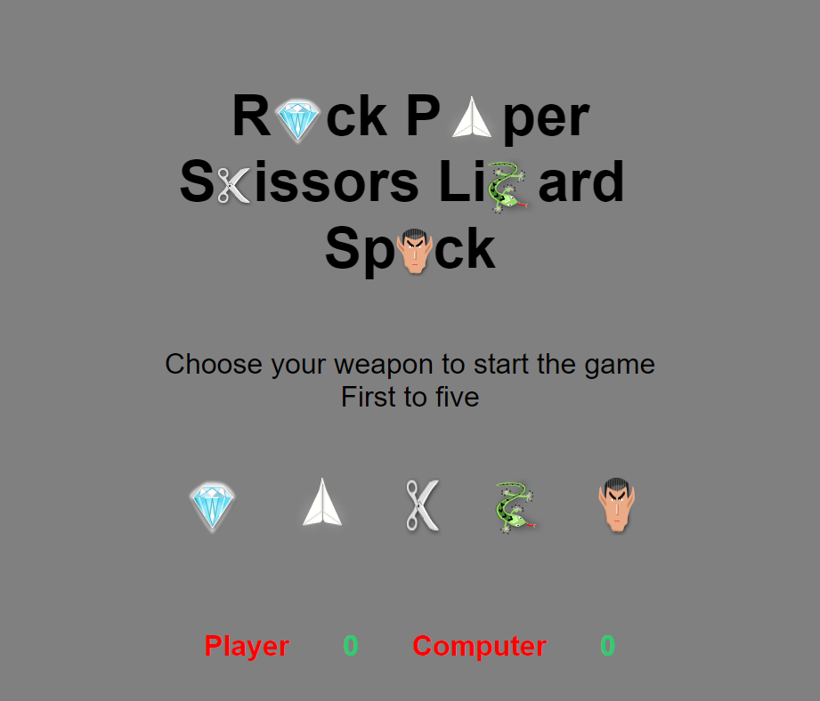

# Rock-Paper-Scissors-Lizard-Spock
This repository contains a simple implementation of the popular game Rock-Paper-Scissors-Lizard-Spock using HTML, CSS, and JavaScript. The game is played on a web browser and provides an interactive user interface for players to make their moves and keep track of the score.

## How to Play

To play the game, follow these steps:

1. Open the `index.html` file in a web browser.
2. You will be presented with a game board displaying five buttons representing the available options: rock, paper, scissors, lizard, and spock.
3. Click on one of the buttons to select your move.
4. The computer will randomly choose its own move.
5. The winner of the round will be determined based on the following rules:

   - Scissors cut paper
   - Paper covers rock
   - Rock crushes lizard
   - Lizard poisons Spock
   - Spock smashes scissors
   - Scissors decapitate lizard
   - Lizard eats paper
   - Paper disproves Spock
   - Spock vaporizes rock
   - Rock crushes scissors

6. The game will update the score after each round.
7. The first player to reach a score of 5 will be declared the winner.
8. Once the game is over, an alert will be displayed, and clicking "OK" will reset the game.

## Features

- User interface with buttons for player moves and a display area for game results and scores.
- 
- A user interface with buttons for the user to select their move and a display area to show the game result and scores
- 
- The ability for the user to play multiple rounds of the game until one player reaches a score of 5
- Randomly generated computer move for each round.
- Game logic that determines the winner based on the rules of Rock-Paper-Scissors-Lizard-Spock.
- 
- Reset functionality to start a new round after one player reaches a score of 5.

## Testing

- Feedback and testing were conducted by friends in the industry to identify any issues or improvements.

- Html was tested with no error using https://jigsaw.w3.org/css-validator/

- Css was tested with no error using https://jigsaw.w3.org/css-validator/

- Javascript was tested with no error using https://esprima.org/demo/validate.html

## Deployment

The game has been deployed to GitHub Pages for easy access and usage. To deploy the game:

1. In the GitHub repository, navigate to the Settings tab.
2. In the GitHub Pages section, select the Master Branch as the source for deployment.
3. Once the master branch is selected, the page will be automatically refreshed, indicating a successful deployment.
4. The live version of the game can be accessed at: [Rock-Paper-Scissors-Lizard-Spock](https://smiding.github.io/Proj2/)

## Credits

The development and creation of this project were aided by the following resources:

- Kevin Witeker for providing valuable testing feedback.
- Jessica Rydberg for assistance with testing and coding questions.
- The images and some code snippets were sourced from [RPSLS.net](https://rpsls.net/#91np2).
- Fonts were obtained from Google Fonts.
- Relevant information and inspiration were obtained from YouTube tutorials:
  - [Rock Paper Scissors Lizard Spock Tutorial](https://www.youtube.com/watch?v=ec8vSKJuZTk)
  - [How to Code Rock Paper Scissors Lizard Spock](https://www.youtube.com/watch?v=GFO_txvwK_c&list=PLdfIxbkZCr0eDJVeZyHR7xKi0QhLNNsJo&index=6&t=31013s)
  - [JavaScript Tutorial: Rock, Paper, Scissors, Lizard, Spock](https://www.youtube.com/watch